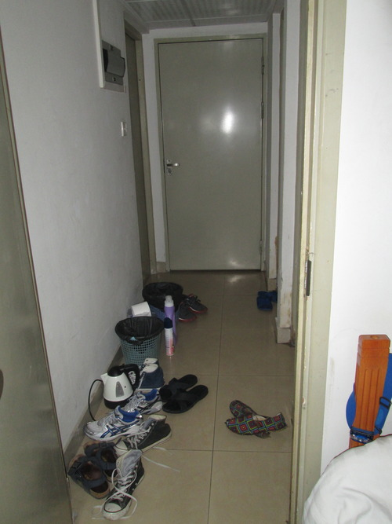
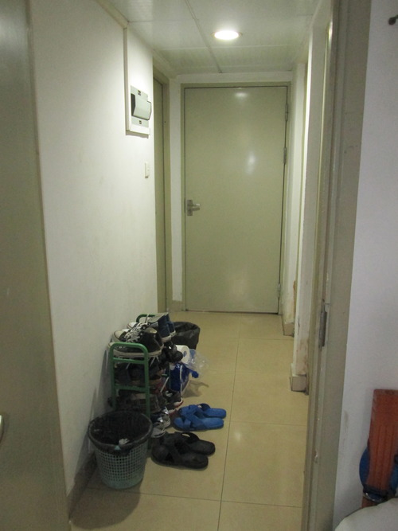

Da un buco poco accogliente e totalmente bianco, siamo passati a vivere in un buco colorato e un po&rsquo; pi&ugrave;
confortevole. Con i soldi arrivati oggi sul conto cinese [se non lo sapeste mi si
&egrave; smagnetizzata la carta di credito] ho acquistato un paio di cose, fra cui una stuoia che mi permette di
stare scalzo in camera, senza avere a che fare con il lindo pavimento. Che lusso!

Il corridoio prima dell&rsquo;intervento. E dopo la sistemazione.

