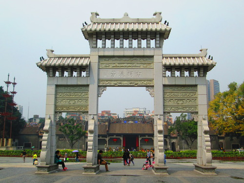
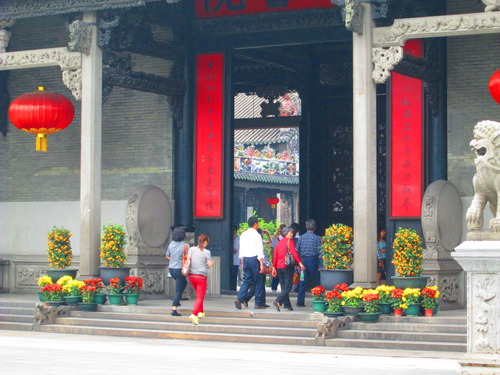
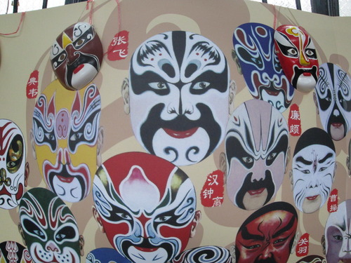
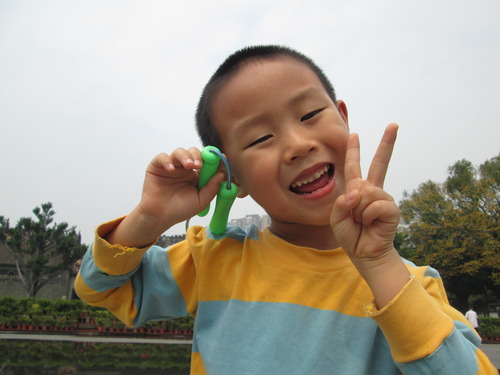
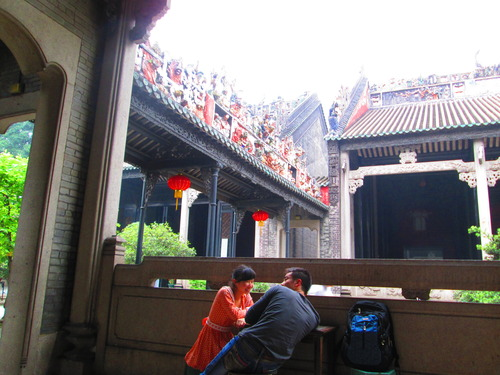
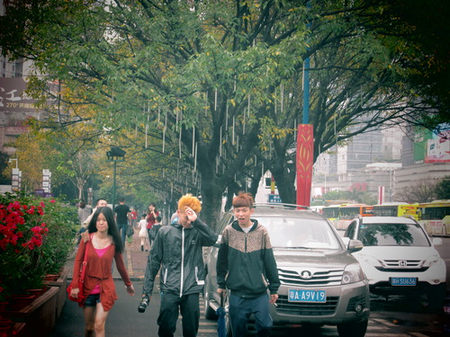
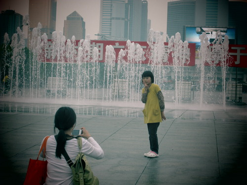

Ed ecco a voi il primo tempio che ho visitato in Cina. Si trova nella citt&agrave; in cui vivo, Guangzhou, a un bel p&ograve; di fermate di metro dal mio campus.

Al solito un p&ograve; di foto, a descrivervi la visita:

Ecco con chi posso fare conversazione con il mio cinese ultra basic.

Stile cinese [ mi ha visto che facevo la foto?! baah]

