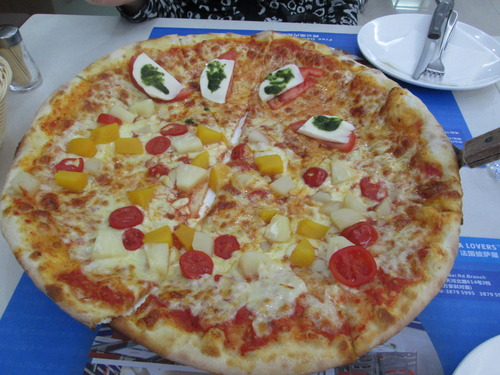
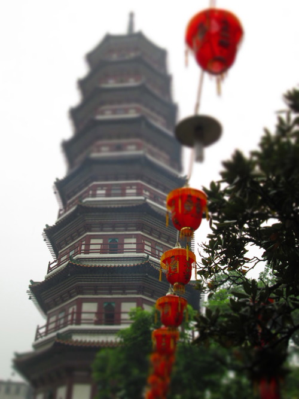
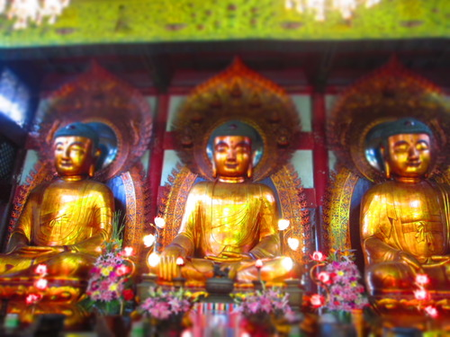
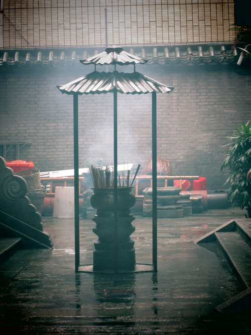
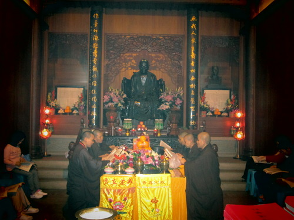
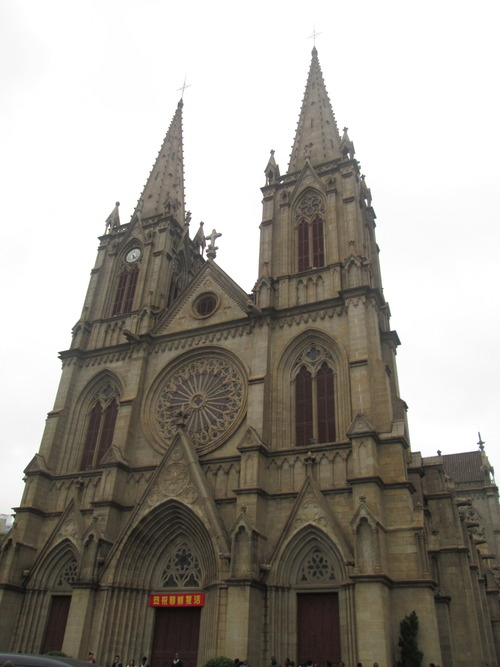
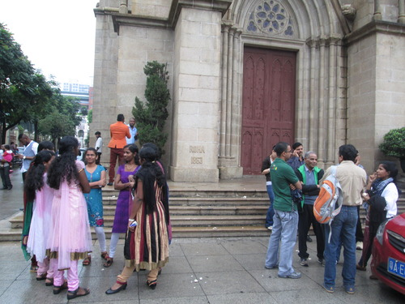
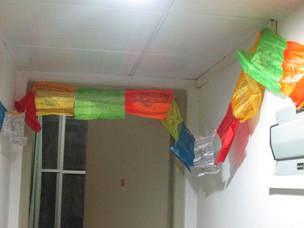

La mia Pasqua in Cina &egrave; stata una giornata lunga e intensa. Tralasciando la pulizia della camera, a questo
punto non tralascio, e il cambio delle lenzuola, si &egrave; sviluppata con un pasto regale a suon di pizza [sono
ancora Italiano, da quel che mi dica Tommi] met&agrave; margherita e met&agrave; &lsquo;Fruit&rsquo;: ananas, pera e
pesca.

Al pranzo &egrave; seguita la visita ad un Tempio Buddista: fantastico. Cantilene, t&egrave; caldo, piogerellina e i
gesti di saluto dei monaci.

Un cappuccio al&nbsp;volo da MacDonald [capite dove bevo il caff&egrave;] con annessa chiacchierata con un vecchietto cinese, con cui ho conversato in inglese e qualche parola di italiano imparata nei viaggi per lavoro in Italia. Gli mancano gli spaghetti, non dirlo a me!

E per concludere sono stato nella Cattedrale di Guangzhou. Un posto dove trovi qualsiasi etnia sulla terra: dagli indiani, ad africani, dai bianchi ai cinesi, ovviamente. In tutto questo ambiente di fede non mi sarei mai aspettato che dei cinesi chiedessero a due italiani di farsi una foto con loro. Vabbe.

Nuova mota di colore alla 301: bandierine buddiste!

