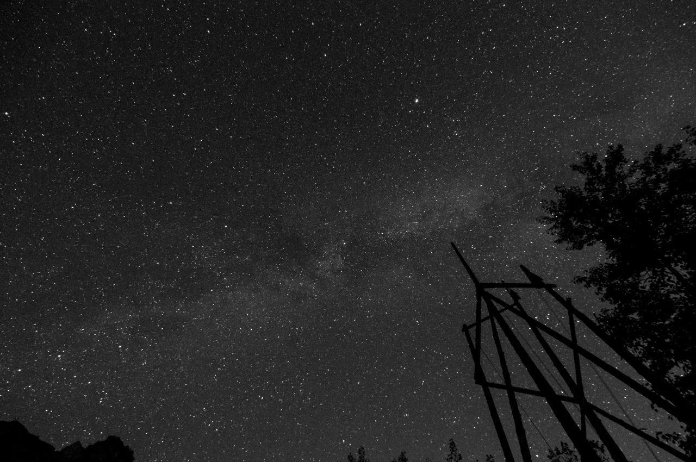

 <figcaption class="caption">Ringrazio Enrico Tamburini per aver immortalato lo splendido cielo che dopo giorni di pioggia ci ha fatto sognare dalla base di Andreis.</figcaption>

Mi sento un po' nomade. Un nomade che lascia la casa padovana ed un sacco di affetti e si lancia in questa nuova avventura svedese. :) &nbsp;Un sacco di sogni lo aspettano, fitti fitti come il cielo stellato dell'ultima notte di CFM. Domani parto con i miei 56 chili, che paiono molti di pi&ugrave;, chiss&agrave; che avventura sar&agrave;!
