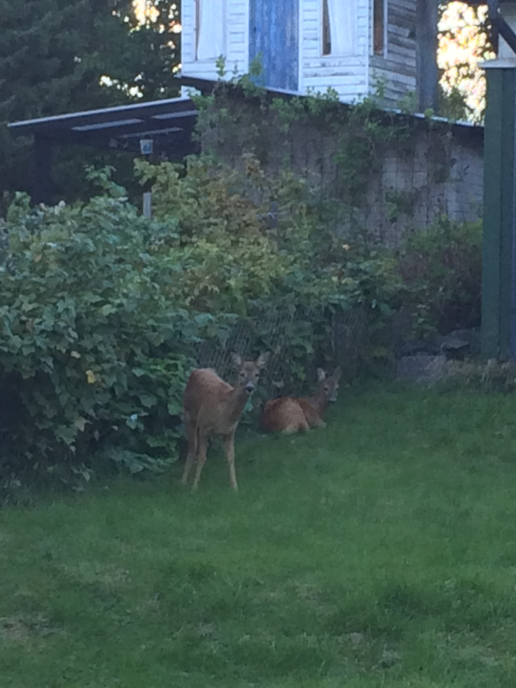

Sono arrivato ormai da una settimana a Stoccolma e me la sto girando in lungo e largo. Vivo in un quartiere residenziale ad un quarto d'ora di metro dal "centro citt&agrave;".

Fin qui tutto nella norma.

Ho una stanza in cui posso allargare le braccia e non toccare nessuno dei quattro muri, acqua calda a tutte le ore e addirittura potabile. Non sputo pi&ugrave; quando mi lavo i denti. ;) Insomma, rispetto agli standard a cui ero abituato in Cina si va a gonfie vele.
Come mi aspettavo, Stoccolma &egrave; circondata dal verde. I parchi sono ovunque, e poi pini, abeti, sempreverde, alberi, alberi.. tanti alberi e pure il mare. Tuttavia non mi aspettavo che andando a fare la spesa debba passare in un bosco dove posso raccogliere mirtilli, di incontrare due picchi, di farmi tagliare la strada alla porta di casa da uno scoiattolo e questi:

Quando li ho visti ho pensato che fossero imbalsamati e gi&agrave; ero l&igrave; a criticare fra me e me il cattivo gusto di questa famiglia svedese. Poi uno ha alzato la testa. Ci siamo guardati, scambiati il numero di telefono, mi ha invitato a merenda. E?! Dei cerbiatti da giardino?!

Tornando a casa ho fatto varie ipotesi su come potessero stare l&igrave; due cerbiatti (perch&eacute; credo siano cerbiatti):

- &nbsp;I padroni di casa mettono una speciale mistura sull'erba che rende dipendenti i cerbiatti che sono quindi costretti a tornare per brucare l'erba;
- E' il set di Bambi il film;
- C'era un filo elettrico che non permette alle bestie di uscire che sono due bestiole da macello;

Mi pare proprio strano che siano animali da compagnia. In ogni caso, passer&ograve; a controllare se vi siano ancora.
Temo solo di incontrare bestie pi&ugrave; feroci per strada, ma in quel caso proporr&ograve; che si pappino il mio coinquilino pi&ugrave; in carne di me. ;)
