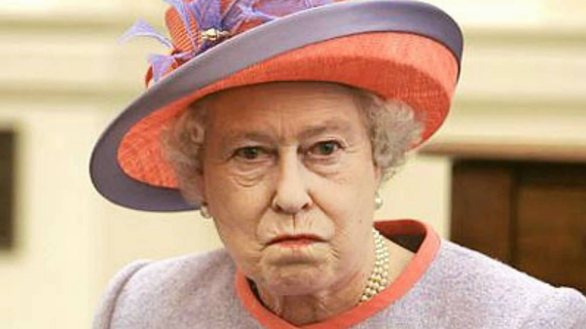

In Cina ho condiviso parte della mia cella con Andrea, ma sto sperimentando in questi giorni cosa significa avere un coinquilino. Anzi, sto sperimentando cosa significa avere un coinquilino inglese.
Il mio <em>flatmate</em> &egrave; Inglese, di Londra, l'unica cosa che gli invidio &egrave; l'accento <em>British</em>. Il suo nome in codice &egrave; "la Regina Elisabetta" visto che ha pi&ugrave; volte sottolineato la supremazia dell'Inghilterra sull'Italia. Folle. Lo stuzzicher&ograve; chiedendogli che ne pensa della Scozia.

La Regina &egrave; un maestro di matematica ad una scuola inglese di Stoccolma, o come si presenta lui: "Aimaticcier" [Il suo precedente coinquilino (italiano) ne fa un'imitazione niente male]. Era un pugile, ma poi lo hanno investito e nell'urto si &egrave; spaccato il ginocchio, poi &egrave; ingrassato. Questa la sua vita.

Dal mio arrivo a Stoccolma, sta seguendo una dieta a base di Coca-Cola, pollo e patate fritte. L'obiettivo &egrave; dimagrire. I suoi hobbies sono andare in palestra dopo aver mangiato un pollo intero e guardarsi "How I met your mother". Quando sento la canzoncina di intro alzo il volume della musica o impreco in italiano. Mi consolo sapendo che la serie ha sette stagioni e sparandosi 5-6 puntate al giorno un'altra settimana e poi finisce.

Ha un concetto di pulizia simile a quello delle "fuwuyuan" cinesi (donne delle pulizie), ossia non ce l'ha. Ci divertiremo!

Un'altra cosa che non ha pi&ugrave;, ma che un tempo aveva, &egrave; la bicicletta di cui era molto orgoglioso. Pi&ugrave; di mille euro aveva speso, ma purtroppo qualcuno gliela ha rubata a scuola. Mi pento di non aver fatto un giro su quella bici perch&eacute; era proprio bella al punto che pensavo di imbarcarla in aereo al mio ritorno. Qualcun altro ha capito che non se la meritava. Poraccio.

Oggi sono particolarmente incavolato con lui perch&eacute; mi son trovato un mozzicone di sigaretta in corridoio.
Cacchio no.

Lo aspetto al varco e poi, come coi lupi: ora raccogli e butti. Ora penso a come dirglielo in inglese.

Faccia della Regina arrabbiata per il furto della bici reale.
