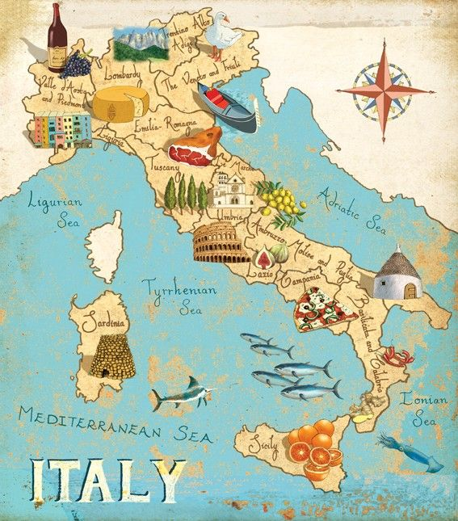

Ero un poco preoccupato da cosa sarebbe saltato fuori dalle conversazioni sul mio bel paese. Studiando in un
programma di demografia in classe facciamo spesso confronti fra i vari paesi di provenienza. I miei compagni di
corso provengono da paesi esotici come l'India, il Nepal o pi&ugrave; vicini come la Germania&nbsp;<em>and so
on</em>. &nbsp;I paragoni sono fatti in relazione &nbsp;alle diverse dinamiche e politiche pubbliche per la
popolazione.

Gi&agrave; alla prima lezione sono uscito allo scoperto come l'italiano casinista: quello che a detta dell'iraniana
canta mente parla inglese (?), quello che sbaglia orario delle lezioni e la fa sbagliare anche agli altri, quello
che sta diventando un tour operator e promotore del turismo italiano.
S&igrave;, perch&eacute; io ero preoccupato che le conversazioni cadessero sugli stereotipi pi&ugrave; attuali.
Berlusconi, i suoi scandali, la politica italiana, la Mafia, invece, i miei compagni di classe sono veramente e
sinceramente interessati dall'Italia per la sua storia e per la sua cultura. Alcuni di loro ci sono gi&agrave;
stati, ma, come immaginavo, non &egrave; stato facile per loro che parlano inglese o lingue incomprensibili girare
in Italia. Solo nei luoghi pi&ugrave; turistici&nbsp;trovano informazioni in inglese e qualcuno che lo parli. Un
peccato. I treni sono un altro tasto dolente e lo posso capire: stento ancora io ad usare velocemente le macchinette
per acquistare i biglietti dei treni alla Stazione, ma &egrave; possibile che loro siano pi&ugrave; svegli di me.
Tanto per cambiare in Stazione a Padova avevo bloccato la Carta di Credito. Strano! [Leggi:&nbsp;<a href="http://bit.ly/ccredito">bit.ly/ccredito</a>]
In breve, le conversazioni pi&ugrave; recenti sono state legate alla Moto Guzzi di uno svedese, che vuole offrire a
me ed un'altra italiana del caff&egrave; Lavazza fatto con la sua moca Bialetti. Il nepalese, invece, mi chiede
consigli sui sughi per condire la pasta e su quali citt&agrave; visitare in estate. Ah, questa &egrave; una perla:
credevano che Venezia fosse distantissima dalla costa, quando gli ho detto che ci si pu&ograve; arrivare in treno e
auto ci sono rimasti un po' male.
Tutto questo per dire quanto ebeti siamo noi italiani. Avremmo un paese che gi&agrave; cos&igrave; come &egrave; ci
offre opportunit&agrave; di turismo di ogni sorta e non ci facciamo molto, cio&egrave; non lo sfruttiamo al massimo.

Ad&nbsp;esempio Padova, la mia citt&agrave;, nessuno la conosce se non perch&eacute; vi &egrave; passato in treno da
Venezia a Verona. Ditemi quanto costerebbe creare un'app per lo smartphone scaricabile gratuitamente arrivato in
stazione che dia informazioni ai turisti?! Potrebbe indicare i percorsi ai monumenti ed ai punti di ristoro o dare
informazioni sugli&nbsp;orari dei mercati e visite guidate. Basterebbe farla creare a qualche studente
dell'Universit&agrave; indicendo un bando in cui, non so, chi crea la migliore app ha un anno di universit&agrave;
gratuita. Si creerebbero relazioni inter-facolt&agrave; fra studenti umanistici e informatici e poi si potrebbe dare
lavoro ad altri giovani che potrebbero condurre le visite.
Forse sono solo mie farneticazioni.
In ogni caso, continuo a promuovere il mio Bel Paese. ;) Orde di vichinghi ci invaderanno.
