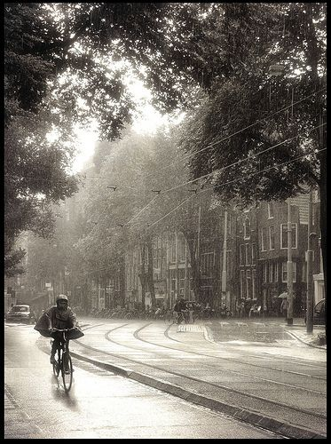

Devo perdere tempo in qualche modo, perch&eacute; mi annoio solo a studiare, a contare le ore di buio, a perdere la metro, a forzare svedesi e non ad avere relazioni sociali.&nbsp;Quindi, cosa ha pensato Chicco?!&nbsp;Avendo una specie di blog&nbsp;in cui sfotto gli svedesi e autoironizzo sulle mie sfighe da studente&nbsp;all'estero, ho pensato (in realt&agrave;, plagiato) l'idea di sentire come se la passano altri studenti italiani (e chiss&agrave; anche stranieri poi) fuori dall'Italia per motivi di studio.

Ormai si sente parlare di&nbsp;questa generazione erasmus, ma non &egrave; l'unico modo per finire all'estero:
perch&eacute; non indagare allora motivi, destinazioni e vedere un po' come &egrave; la vita da studente all'estero?

Da queste idee balzane nasce la mia nuova perdita di tempo.

Ad inaugurarla &egrave; Irene, una mia ex compagna di corso a Statistica a Padova, che ha deciso di vivere in un paese s&igrave; pi&ugrave; al sud della Svezia, ma non di certo famoso per il sole e gli inverni miti
[o forse s&igrave;, ma sono io ignorante].

La parola a lei! ;)

A fine agosto del 2013 sono arrivata a Leiden (in Olanda), citt&agrave; in cui vivo tuttora. Mi sono trasferita per seguire un corso di studi presso l'universit&agrave; di Leiden, nello specifico un master in statistica (MSc in Statistical Science for the Life and Behavioural Sciences). Dunque, mi trovo in Olanda da poco pi&ugrave; di un anno e di certo rimarr&ograve; qui fino a Settembre-Ottobre dell'anno prossimo. Poi si vedr&agrave;...

**E' la prima volta all'estero o hai gi&agrave; avuto altre esperienze di studio all'estero
precedentemente?**

Quella attuale &egrave; la mia seconda esperienza all'estero. La prima volta che ho lasciato l'Italia per
lo studio &egrave; stato durante il secondo anno di laurea triennale per un'esperienza erasmus di cinque
mesi presso l'universit&agrave; di Tilburg (sempre in Olanda, amo questo paese!!)

**Hai partecipato al progetto Erasmus o ad altri bandi?&nbsp;**

Ho partecipato solo al bando per il progetto Erasmus.

**Come &egrave; vivere all'estero?**

Oddio, un p&ograve; difficile la domanda da rispondere in poche righe. Cercher&ograve; di fare un elenco
sintetico di ci&ograve; che mi piace di pi&ugrave; e ci&ograve; che mi piace di meno del vivere
all'estero:

**PREGI** (alcuni specifici del vivere in Olanda):

- conoscere molte persone, specialmente di paesi e culture diverse: si tratta secondo me di una fonte di
  "ricchezza" preziosissima;
- parlare inglese e la facilissima comunicabilit&agrave; con gli olandesi (di tutte le et&agrave;), per
  i quali l'inglese &egrave; una seconda lingua;
- viaggiare in bicicletta sentendomi la regina della strada (qui in Olanda ci sono pi&ugrave; piste
  ciclabili che strade per le auto) e non dover rischiare la vita buttandomi in mezzo alle macchine per
  attraversare;
- la puntualit&agrave; dei mezzi pubblici;
- la sicurezza in generale (anche se esco la sera tardi da sola, mi sento sempre al sicuro);
- vivere da sola ed essere autonoma;
- gli olandesi sono "free" seppure siano molto rispettosi l'uno dell'altro, e la cosa mi piace
  molto.

  **DIFETTI:**

- vivere lontano dal proprio ragazzo;
- sentirsi talvolta da sola, sentire la nostalgia degli amici;
- mi manca moltissimo magiare in compagnia;
- mi manca ogni tanto il cibo di casa (sebbene modestamente mi ritengo una cuoca discreta);
- se stai male (se hai la febbre per esempio) devi avere cura di te stesso senza l'aiuto di nessuno;
- non mi piace la passione degli olandesi per la birra e la sbronza;
- non mi piace il meteo olandese, tipicamente caratterizzato da forti venti e piogge giornaliere.

**Cosa ti manca dell'Italia?**

In realt&agrave; per sbaglio ho risposto in parte alla domanda precedente. Comunque stilo qui l'elenco
completo delle cose che mi mancano del mio paese (l'elenco non &egrave; da considerarsi in ordine di
importanza):

- le uscite con gli amici (e col ragazzo ovviamente, che per&ograve; tanto &egrave; all'estero, quindi non
  so se includerlo nel contesto italiano);
- i momenti in famiglia: le cene in compagnia dei miei genitori, il cibo di casa, le visite a mia nonna e
  ad una mia zia in particolare;
- la mia scuola di danza: le lezioni dei miei maestri, i concorsi e il saggio di fine anno, ballare con le
  mie compagne;
- tutti i possibili panorami (colli, mare, montagna, laghi), specialmente la montagna e i rifugi!;
- la pizza;
- il teatro (purtroppo in Olanda gli spettacoli teatrali, ovviamente, sono in olandese);
- parlare italiano (nessuno dei miei compagni di classe &egrave; italiano e non conosco molte persone
  italiane, quindi raramente ho occasione di parlarlo) e pure ascoltare il dialetto veneto parlato dai miei
  parenti e dalla gente in citt&agrave;;
- il bidet;
- alcuni prodotti che qui in Olanda non trovo (come il bicarbonato o l'acqua di rose, che &egrave; un
  tonico per il viso);
- il cinema tradotto (qui in Olanda i film sono tutti in lingua originale coi sottotitoli olandesi, quindi
  i film la cui lingua originale non sia l'inglese o l'italiano non li posso vedere);
- il meteo (anche se devo ammettere che sta peggiorando ultimamente);
- la comodit&agrave; della mia casa, l'igiene e l'ordine.

**E cosa non ti manca?**

La vita costante coi miei.

**Perch&eacute; hai deciso di studiare all'estero?**

Ho deciso di studiare all'estero nella speranza di avere pi&ugrave; carte da giocare nel
momento in cui dovr&ograve; cercare un lavoro, anche una volta tornata nel mio paese. In principio ho
comunque deciso di studiare all'estero, in Olanda nello specifico, con l'idea di aprirmi pi&ugrave; porte
per il futuro, con l'intenzione di cercare lavoro anche in questo paese, che penso sia molto affine al mio
stile di vita e quindi il migliore nel caso scegliessi di trasferirmi definitivamente.

**Quali sono gli aspetti positivi dell'universit&agrave; all'estero (metodo di studio, organizzazione, professori) e quelli dell'universit&agrave; in Italia?**

All'estero, per lo meno per la mia esperienza, c'&egrave; un approccio allo studio nettamente
pi&ugrave; pratico (con assignments settimanali ed esami pratici con possibilit&agrave; di consultare note e
libri) e molto pi&ugrave; consono per la preparazione al mondo del lavoro. Nel contempo lo studente deve
essere autonomo, anche nell'approfondire argomenti necessari ma non spiegati in classe (e richiesti negli
assignments); questo per&ograve;, a quanto &egrave; sorto discutendone con altri compagni di classe,
&egrave; una caratteristica tipica dei master (per lo meno di molti immagino). I professori sono molto
aperti e "easy": svariate volte mi &egrave; capitato di essere seduta affianco a loro durante il pranzo e
scambiarci due chiacchiere. Nel complesso apprezzo molto questo approccio allo studio.
In Italia la teoria &egrave; alla base di tutto e poca pratica. Personalmente durante i tre anni di
triennale ho sempre percepito un certo distacco tra studente e professore, sebbene alcuni fossero davvero
molto disponibili e alla mano. Mai pranzato con nessuno di loro. Secondo me tutte le specialistiche
dovrebbero essere in inglese anche in Italia. L'assenza di assignments, se da un lato &egrave; una carenza
delle universit&agrave; italiane, dall'altro rende la vita pi&ugrave; leggera agli studenti. Lo stesso vale
per il numero totale di appelli all'anno per uno stesso esame (4 in Italia contro 2 nell'attuale
universit&agrave; in cui studio).

**Cosa pensi dell'universit&agrave; italiana e del nostro paese?**

Penso che l'universit&agrave; italiana non sia realmente in grado di preparare gli studenti per il
mondo del lavoro. Una base teorica &egrave; importante, ma la pratica lo &egrave; altrettanto. Almeno per
quanto riguarda statistica inserirei molti pi&ugrave; corsi pratici (per ogni corso insegnato un monte ore
di laboratorio al computer) e l'obbligatoriet&agrave; dello stage prima della laurea. Renderei tutti i corsi
di laurea specialistica in inglese e inserire pure dei corsi in inglese alla triennale. Insomma, mi dispiace
ammetterlo, ma non ho molta stima del sistema universitario italiano, seppure mi sia piaciuto molto il corso
triennale che ho fatto presso l'universit&agrave; di Padova. Ma il piacere non sempre corrisponde alle
richieste provenienti dall'esterno in termini di competenze.

**Dopo gli studi pensi di tornare nel Bel Paese?&nbsp;**

Ora come ora, il mio piano ideale sarebbe lavorare uno o due anni in Olanda per farmi un p&ograve; di
esperienza come consulente statistico e poi tornare in Italia nella speranza di avere un curriculum
abbastanza competitivo per poter ottenere un lavoro soddisfacente e non in ambito economico. Il mio
desiderio &egrave; tornare in Italia prima o poi, nonostante tutto, la sento casa e mi dispiacerebbe dover
rimanere per sempre lontana dalla mia famiglia e dal mio paese di per s&eacute;. Sono speranzosa e fiduciosa
possano davvero cambiare le cose per il meglio, seppure nel lungo tempo. Tuttora non smetto di aggiornarmi
tutti i giorni sulle novit&agrave; del mio paese, di qualsiasi aspetto si tratti: politico in primis.

Non scarto comunque l'idea di restare all'estero. Tutto questo, dovendo tenere in considerazione le
"questioni di cuore". Ancora devo affrontare l'argomento sotto questo aspetto, quindi vedo davvero un grosso
punto interrogativo per ci&ograve; che far&ograve; una volta laureata: ho solo dei sogni e dei piani
immaginari.

**Grazie veramente Irene per aver espresso la tua opinione! :)**
