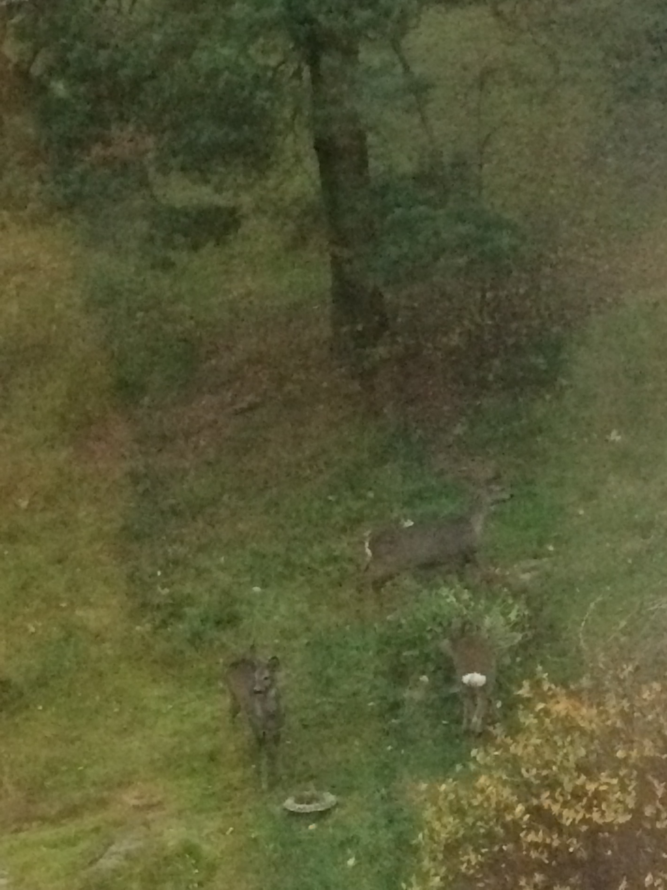

Ormai sono abituato che qui mi fanno regolarmente due domande: la prima &egrave; "che piani hai per il weekend?", la
seconda "che hai fatto nel weekend?". Forse pensano di essere gentili, in realt&agrave; gli sto facendo capire che o
mi fanno qualche proposta per il weekend o non me l'hanno da fare la domanda. Non capisco se siano pigri o se
proprio gli piaccia gioire dell'oscurit&agrave; chiusi in casa.

Bah. Domani risponder&ograve; cos&igrave;.
Sono rimasto a casa per scrivere le risposte all'<em>assignment</em> su famiglia e fertilit&agrave;, ma ho scritto
meno di met&agrave; pagina. Evviva. In compenso, ho assistito alla performance di un inglese (Regina) e un irlandese
(l'amico pirla della Regina), ubriachi dalle tre del pomeriggio, che cantavano le migliori hit dei Backstreet Boys.
Due trentenni che pensano di essere ancora adolescenti. Get a life! [Caspita parla quello che ha la camera
disseminata di articoli su famiglia, fertilit&agrave; e so on]

Ah, ho rivisto sotto la finestra della cucina i cerbiatti. Ho fatto una testa tanta al nepalese in classe con me sul
deficiente di Regina e sul fatto che vogliono alzarmi l'affitto cos&igrave;, non si sa il perch&eacute;. Ho fatto
una lasagna. Ho finito il salame di casa.
Poi chieder&ograve;&nbsp;"and you?". "I laid on the sofa".
E io penser&ograve; che me lo chiedesse per raccontarmi qualcosa di figo.
