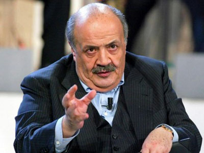

Terzo appuntamento con uno studente italiano all'estero che racconta la sua esperienza fuori dalla realtà
Italiana. Ho conosciuto Elena al CFT (Campo Formazione Tirocinanti, se non erro, le sigle non sono il mio
forte). Io, che amo le cose semplici, ho rubato l'iscrizione a tale campo ad un gesuits della nostra
Co.Ca. (Grazie Marco!!). Ho un ricordo che ad un cerchio serale avesse fattoun'imitazione di Maurizio
Costanzo niente male, anzi da sbellicarsi. A voi Costanzo!

<em>Ciao! Mi chiamo Elena, vivo a Vicenza e sono iscritta alla magistrale di Editoria e Giornalismo a Verona. Sono
laureata nella triennale di Scienze della Comunicazione, sempre a Verona, e questo &egrave; il mio ultimo anno
di universit&agrave;. Ora mi trovo in Belgio, ad Anversa, per un'esperienza Erasmus di cinque mesi.&nbsp;</em>

<strong>E' la prima volta all'estero o hai gi&agrave; avuto altre esperienze di studio all'estero
precedentemente?</strong> 
<em>Ho gi&agrave; avuto uno scambio culturale con Inghilterra, ma &egrave; durato solo una settimana, per cui non la
considero un'esperienza particolarmente significativa.</em>
<strong>Hai partecipato al progetto Erasmus o ad altri bandi?&nbsp;</strong>
<em>Sto partecipando al progetto Erasmus.</em>
<strong>Come &egrave; vivere all'estero?</strong> 
<em>Meraviglioso. Si imparano tante di quelle cose ogni giorno... soprattutto convivendo con persone di tutte le
nazionalit&agrave;. Inoltre, secondo me, si impara a diventare "grandi": gestire i soldi, cucinare, andare in
lavanderia a gettoni, organizzarsi con i ritmi un po' allucinanti della vita notturna da Erasmus, affrontare
esami e lezioni in un'altra lingua e cos&igrave; via. Sicuramente &egrave; un ottimo metodo per
maturare.&nbsp;</em>
<strong>Cosa ti manca dell'Italia?&nbsp;</strong> 
<em>Senza voler offendere nessuno... non molto. Forse la buona cucina della nonna, i miei amici e la mia famiglia.
Ma per il resto, in quanto a vita concreta, sto benissimo in Belgio.</em>
<strong>E cosa non ti manca?</strong> 
<em>Non mi manca il pregiudizio. Per quanto i belga non siano un popolo particolarmente facile... d'altro canto
possiedono una dote, ai miei occhi, inestimabile: sono tolleranti e pacifici verso ogni tipo di
nazionalit&agrave;. Qui ad Anversa si vedono persone dal tutto il mondo e appartenenti ad ogni religione. Se una
cosa del genere avvenisse in Italia... beh, lo sapete anche voi.&nbsp;</em>
<strong>Perch&eacute; hai deciso di studiare all'estero?</strong> 
<em>Perch&eacute; ho pensato che potesse essere un esperienza curricolare di un certo peso e che mi avrebbe "aperto
la testa" (ovviamente in senso metaforico).&nbsp;</em>
<strong>Quali sono gli aspetti positivi dell'universit&agrave; all'estero (metodo di studio, organizzazione,
professori) e quelli dell'universit&agrave; in Italia?</strong> 
<em>TUTTO. Ma ora entro pi&ugrave; nel dettaglio:</em> 
<em>- i professori ti trattano come un essere pensante.</em> 
<em>- il metodo di esame &egrave; organizzato un po' come nelle scuole superiori, con diverse prove intermedie o con
l'esame suddiviso in parti differenti. Penso sia il metodo migliore anche per lo studio, perch&eacute; non si
cade nella tentazione di studiare tutto all'ultimo secondo. Sei costretto a stare al passo, ed &egrave; un
bene.&nbsp;</em> 
<em>- in programma ci sono quasi sempre lavori di gruppo. Credo che sia uno dei migliori sistemi per insegnarci un
approccio alle future relazioni lavorative (magari odi uno che &egrave; in gruppo con te, ma che ci puoi fare,
il lavoro lo devi fare comunque!).&nbsp;</em> 
<em>- per non parlare del contenuto dei corsi! Sono REALMENTE formativi. Impari davvero qualcosa che pu&ograve;
servirti in futuro. Incredibile, no?</em> 
<em>- c'&egrave; un sistema informatizzato che agisce da agenda attraverso cui gli insegnanti possono mettersi in
contatto con gli studenti del loro corso.</em> 
<em>- ci sono moltissime lezioni in inglese, pensate apposta per gli studenti Erasmus. Nella mia universit&agrave;
non esistono.</em> 
<em>- gli insegnanti sanno perfettamente l'inglese. In Italia sentire un professore (italiano) parlare in inglese
&egrave; come ascoltare una barzelletta.</em> 
<em>- pagano l'universit&agrave; da 0 a 650 euro. Praticamente la met&agrave; di una mia retta annua.</em> -<em>&nbsp; i professori qui in Belgio hanno sempre e comunque un comportamento professionale, non si lamentano del
loro stipendio e non hanno l'atteggiamento frustrato da vittima della situazione.</em>
<strong>Cosa pensi dell'universit&agrave; italiana e del nostro paese?</strong> 
<em>Credo di aver risposto nella domanda superiore. Diciamo che in Italia il sistema scolastico e universitario
&egrave; cementato nel passato. Non offre conoscenze all'altezza e al passo con i tempi, spesso limitandosi alla
mera nozionistica o non inserendo nei programmi di corso elementi che ci sarebbero davvero utili nel lavoro, un
giorno. Non offre esperienze pratiche che abbiano vero valore curricolare... e in ogni caso, chi ti assume oggi
in Italia? Mi sento abbastanza scoraggiata nei confronti dell'idea di un mio eventuale futuro lavorativo in
Italia. Trova lavoro solo chi ha conoscenze e contatti, non esiste il concetto di "meritocrazia".</em>
<strong>Dopo gli studi pensi di tornare nel Bel Paese?&nbsp;</strong> 
<em>Per forza, devo finire la magistrale. Ma &egrave; da un pezzo che mi accarezza l'idea di tornare all'estero,
dopo la laurea. Non so come, n&eacute; quando, n&eacute; dove... di certo per&ograve; i paesi del nord Europa
continuano ad affascinarmi. Magari la Danimarca o l'Olanda. Chiss&agrave;!</em>
&nbsp;
Grazie mille e Buona Strada!!
&nbsp;
P.S.
Qui in Svezia, non &egrave; considerato nord la Danimarca e l'Olanda ;) !
