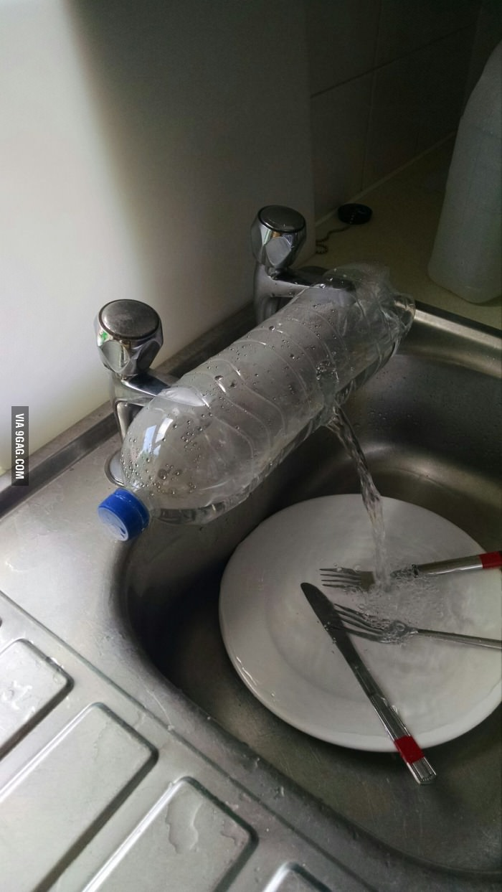
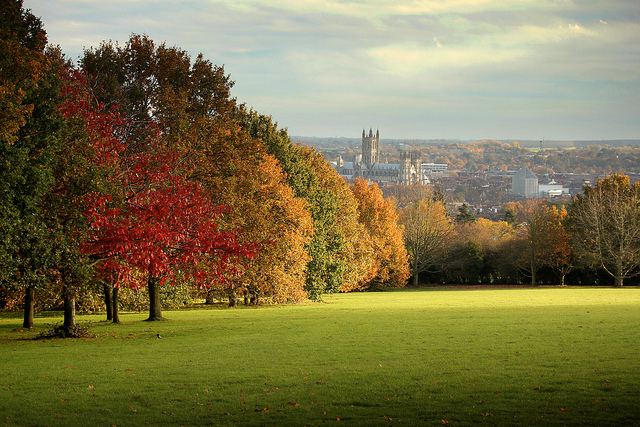

Pare che sia in grado di fare tutto a parte scrivere questo assignment sulle migrazioni. Quindi, eccomi che mi trovo
a pubblicare un'"intervista" di un secondo erasmus in Inghilterra: Ikki, pardon, Francesco. Ancora adesso i lupi del
Padova 7&nbsp;&nbsp;credono sia mio fratello e non sono state poche le volte in cui mi chiedessero come stesse.
Tuttavia, ora non &egrave; pi&ugrave; un rover da comandare, ma &egrave; uno studentello nella terra che ha dato i
natali alla Regina, mio ottimo coinquilino [potesse morireammazzato]. Ve lo presento con questa foto, che ha detto
essere di alcuni suoi amici, che descrive i gradi di ingegneria idraulica degli studentati inglesi.

Hi ya&nbsp;!! I&rsquo;m Francesco, I come from Padova and I&rsquo;m studying right now at the University of Kent In
Canterbury (England), thanks to the Erasmus program. It&rsquo;s my second year of bachelor degree in &lsquo;Modern
Languages and Literatures&rsquo;, and I&rsquo;ll be staying here for the whole academic year = 9 months
<strong>Is this study experience&nbsp;the first one in a foreign country?</strong>
No, It&rsquo;s my first time ever abroad! It might sound scary, but I&rsquo;m still alive!!
<strong>Did you take part in the Erasmus program or in other exchange agreement?</strong>
I&rsquo;m taking part in the Erasmus+ program.
<strong>What do you think about living in a foreign country?</strong>
Simply fabulous. Quite tough at the very beginning, as everything was new and you have to make your own living.
Moreover, I&rsquo;ve never lived alone before, much less in a foreign country, so very soon I came across some
struggles like...doing the washing up with separated taps in the basin!! and that means that either you get burned
or you freeze your hands!! But finally, the most impressive thing is how many friends from all around the world you
can find.

Foto col sole per farmi invidia.

<strong>What do you miss from Italy?</strong>
I miss about my home country:

<ol>
    <li>The weather above all!! I personally proved that the universal stereotype about Britain as a rainy country is
        true!!</li>
    <li>&lsquo;I periodi di cazzeggio sfrenato durante i mesi di lezione all&rsquo;universit&agrave;&rsquo; (poi
        capirete perch&eacute;:D)</li>
    <li>Not so much the Italian food, as I&rsquo;m doing my best to cook Italian even though the row materials are not
        that good at all!</li>
    <li>Chestnuts!! Apparently they are not sold anywhere, and what is autumn without &lsquo;roast chestnuts&rsquo;?!
        (I&rsquo;m gonna pick them up somewhere in the wood)</li>
    <li>The mixed taps!!</li>
    <li>Friends e &lsquo;gli scouti&rsquo; of course</li>
</ol>
Actually, I don't know what I do not miss.
<strong>Why did you decide on studying abroad?</strong>
I decided to go to study abroad basically because I am studying languages and the best way of learning a language is
    going where it is spoken. Secondly, because I love this country.

Foto col cielo blu perch&eacute; mi vuole male

<strong>Which are the positive&nbsp;feature of a foreign university and of a university in Italy?</strong>
From the very start of this term I realized how different is their way of teaching here, compared to ours. Firstly,
tuition is made up of 'lectures', which seem more like our academic lessons, and 'seminars', very small classes of
10 people maximum in which you have to share your opinion and comments to the rest of the class about what you've
studied the week before. It's more an active way of learning and it makes you thinking critically rather than
learning by heart what the teacher says. Secondly, exams are mostly coursework and that means that you don't have
exams at the end of the semester! on the contrary, you are suppose to do essays during each terms and oral
presentations on topics of personal interest. I'm definitely not use to it!
<strong>What's your opinion on the italian university and our country?</strong>
I believe that we mostly lack the critical way of studying, as we are never asked, apart from the final dissertation,
to express our own point of view about our studies. Then overcrowded classes can&rsquo;t help that of course, and we
don&rsquo;t have as many facilities as they have here. But everything has an explanation: tuition fees in UK are
about 9000 &pound; per year!!!

Gli scoiattoli li ho anche qua ti&eacute;

<strong>Are you planning to come back to Italy after your graduation?</strong>
I would love to come back here again after my graduation, but probably not to study!
Cheers
Buona Strada Ikki!
