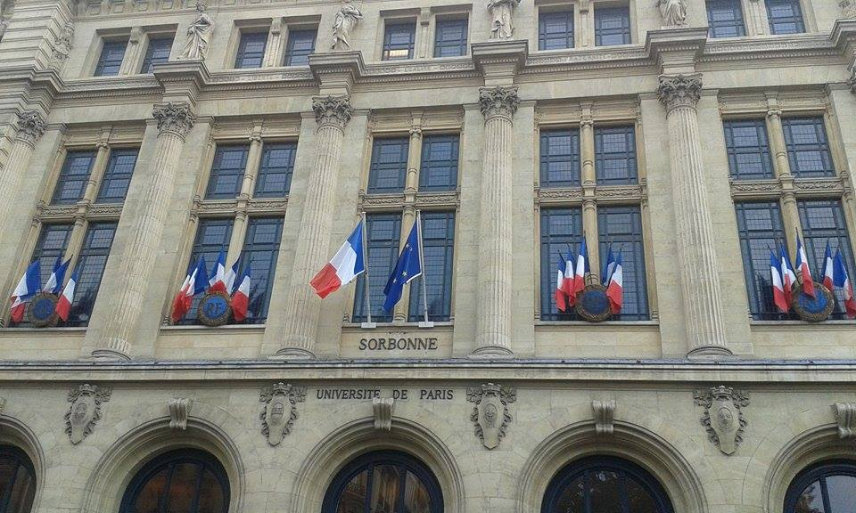

Per la serie gli Ikki nel mondo (per i non scout, il porcospino de "Il libro della Giungla"), ospito nel mio blog
un'intervista ad una Ikki Piemontese adottata dall'Emilia-Romagna! Ho conosciuto Lucia alla Ross nella terra dei
mangiapiadine. Lascio la parola a lei.

Ciao! Hello! Salut! I&rsquo;m Lucia and I&rsquo;m from Ivrea, a nice village between Torino and Aosta famous for
Adriano Olivetti and the Battle of Oranges (if you don&rsquo;t know about them, check it and enjoy!). I&rsquo;m
studying geography (yes, geography! I know that everyone is surprised, but exists someone studying geography!) at
the University of Bologna. Right now I&rsquo;m living in Paris with an Erasmus+ program at the Sorbonne University
for 5 months of my last year of the master degree.
<strong>Is this study experience the first one in a foreign country?</strong>
Yes, it is! Before my departure I was quite scared, but there is no one who says that Erasmus was a bad experience,
so I couldn&rsquo;t be the first!
<strong>Did you take part in the Erasmus program or in other exchange agreement?</strong>
I&rsquo;m taking part in the Erasmus + program (same that Erasmus, it has only changed name)
<strong>What do you think about living in a foreign country?</strong>
It&rsquo;s a really precious experience! You are immersed in a different culture, you could discover many new things,
and you could also admire something that you have never noticed of your home country! In addition, if you&rsquo;re
living in a big or university city, you could meet people from all over the world! You must learn to manage by
yourself, but the world isn&rsquo;t so big, and you will find someone like you for sure!
<strong>What do you miss from Italy?</strong>
For sure the weather and the food (It&rsquo;s incredible how all over the world they eat pasta as a mean dish with
vegetables and meat!), the caos in my brother&rsquo;s room, my sister who plays her ukulele 24 hours each day, the
&ldquo;Italian bathroom&rdquo; (or at least a sink in the toilet), certainly my friends, but fortunately it exists
skype!
<strong>Why did you decide on studying abroad?</strong>
I decided on studying abroad because my department is really little (here they could say mignon), teachers are every
time the same in the bachelor and master courses, and I&rsquo;m really worried that I&rsquo;ll never learn many new
things. Furthermore I&rsquo;d like to learn a new language, and living here it&rsquo;s impossible not to learn
French!
<strong>Which are the positive feature of a foreign university and of a university in Italy?</strong>
Here the methodology is completely different from Italy, during the master degree all the classes are practical and
technical, everyone has already studied the theory during the bachelor and, finally during the master, you could
utilize your knowledge. Of course you&rsquo;ll learn something new, but everything follows the final achievement of
working in the real world. One of the think that I begun to appreciate of my home university is the bureaucracy!
Here for anything you must have a card and many sheets, internet and the site web are like unknowns, you must go to
the office, and hope that someone will understand you in your poor French (English is absolutely forbidden).
&nbsp;

<strong>What&rsquo;s your opinion on the Italian university and our country?</strong>
If you would like to be a theorist you&rsquo;ll have a great knowledge after your studies! Joking aside, I think that
now in Italy there is a strange mechanism for whom youths haven&rsquo;t many possibilities to work, maybe because of
the surplus of notions and the lack of practice in our Universities.
<strong>Are you planning to come back to Italy after your graduation?</strong>
Yes, for sure! I&rsquo;d like to work in our country, but I can&rsquo;t exclude that I&rsquo;ll continue to study
somewhere for a little while yet&hellip;
Bon courage &agrave; tous, and sorry for my English, but now my brain is focus only on French!
&nbsp;
Merc&igrave; Lucia!
