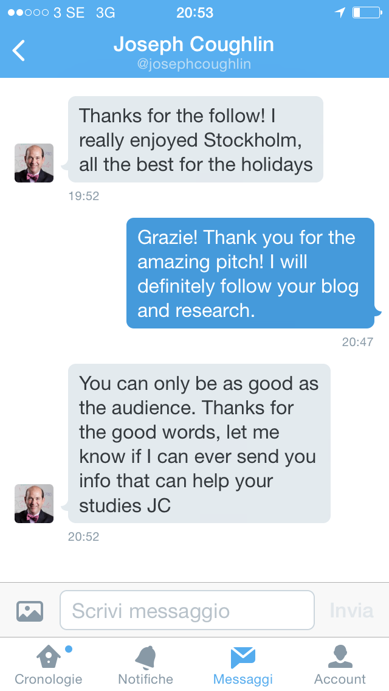

Ieri sera, dopo aver spignattato tutto il pomeriggio per la cena di questo venerd&igrave;&nbsp;[ho ospiti svedesi e
ci tengo a tenere alto il valore&nbsp;della cucina Italiana,... cucino in anticipo per evitare problemi tecnici e
perch&eacute; sono convinto che il cibo sia pi&ugrave; buono lasciandolo un po' l&agrave;], sono andato in palestra
e ho ricevuto il <em>follow back</em> su Twitter da uno dei relatori del <em>Nobel Week Dialogue</em>, a cui avevo
partecipato Marted&igrave;.
Fin qui nulla di strano.
Se non che il tale Joseph Coughlin, direttore del&nbsp;&nbsp;Massachusetts Institute of Technology AgeLab, mi scrive.
Non mi ha offerto un posto strapagato in U.S. [folle], ma mi ha ringraziato per aver cominciato a seguirlo e ha
affermato che Stoccolma gli &egrave; piaciuta. A te. Perch&eacute; ci sei stato tre giorni, volevo dirgli io. [In
realt&agrave;, &egrave; bella, ma io sto sempre, o dovrei stare sempre, a studiare]
&nbsp;

&nbsp;

Non vorrei addentrarmi in polemiche contro l'Universit&agrave; Italiana. Peraltro penso che noi studenti
italiani siamo ben preparati ed infatti io qui posso fare corsi pi&ugrave; avanzati di statistica perch&eacute; ho
un buon background dagli studi triennali a Padova.

Vorrei per&ograve;&nbsp;&nbsp;evidenziare l'atteggiamento che c'&egrave; verso gli studenti fuori dell'Italia. Gli
studenti sono valorizzati, ritenuti "essere pensanti" e addirittura coinvolti. Al professor Coughlin non avevo
scritto io, ma ha letto la mio Bio su Twitter e ha visto che studio Demografia a Stoccolma.
Un amico mi ha spiegato questa diversit&agrave; di atteggiamento da parte dei professori con tre motivi: primo,
potrebbero avere di fronte un futuro studente, secondo, un futuro collaboratore o terzo,&nbsp;un futuro collega.
Neanche l'Universit&agrave; all'estero &egrave; perfetta, basti pensare ai debiti con i quali escono
dall'Universit&agrave; gli studenti statunitensi, per&ograve; c'&egrave; da imparare.
Magari ci sveglieremo e ricominceremo ad attrarre studenti e ricercatori. Per il momento, Mr Coughlin ti sei messo in
un bel guaio!
&nbsp;
Il blog del suddetto: <a href="http://www.josephcoughlin.com">www.josephcoughlin.com</a>
&nbsp;
