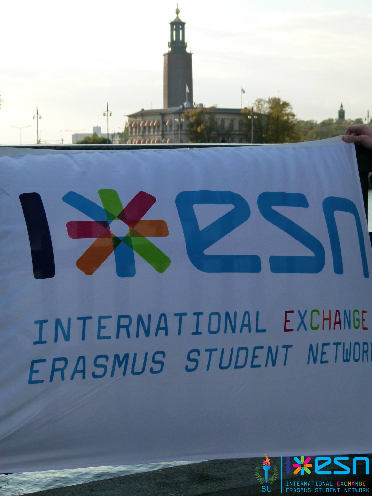
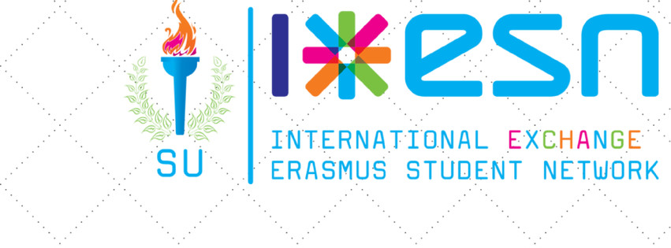

Questa volta gioco in casa! Ho chiesto ad Alessandro, italiano rappresentante dell'ESN, l'Erasmus Student Network,
che vive e studia a Stoccolma di rispondere alle mie solite domande. Io devo ammettere di avere un po' snobbato gli
Erasmus in questi primi 5 mesi a Stoccolma: sar&agrave; perch&eacute; li ho etichettati come "festaioli",
sar&agrave; anche perch&eacute; cercavo di crearmi un network di amicizie pi&ugrave; "solide" visto che a Stoccolma
ci star&ograve; due anni. L'idea di fare amicizie "a termine" mi faceva paura perch&eacute; significava, nella mia
idea, di ricominciare ogni volta. Alessandro porta un punto di vista diverso dal mio e lo ringrazio per questo. :)

&nbsp;
A voi Alessandro da Stoccolma!
&nbsp;

<strong>E' la prima volta all'estero o hai gi&agrave; avuto altre esperienze di studio all'estero
precedentemente?</strong>
No, ho fatto l&rsquo;Erasmus in Svezia nel 2011. La citt&agrave; si chiamava Umea ed era molto a nord. Molto vicino
al circolo polare artico. Un esperienza indimenticabile. E&rsquo;stata la mia vera prima esperienza all&rsquo;estero
che poi ho esteso per fare ricerca per la mia tesi.
<strong>Hai partecipato al progetto erasmus o ad altri bandi?</strong>
Si ho partecipato al bando erasmus.
<strong>Come &egrave; vivere all'estero?</strong>
Sicuramente affascinante e stimolante ma bisogna sempre tenere bene a mente che bisogna averlo dentro di partire e
lasciare tutto. Io vengo da una piccola citt&agrave; di centomila anime (La Spezia) e sicuramente Stoccolma &egrave;
una citt&agrave; molto pi&ugrave; vivace e internazionale.
<strong>Cosa ti manca dell'Italia? </strong>
La cultura e il fatto che sono nato e cresciuto qui. Tutte le abitudini e modi di fare sono insostituibili se cresci
in un posto per pi&ugrave; di vent&rsquo;anni. Vivendo in Svezia mi manca anche il modo di fare delle persone
(c&rsquo;&egrave; pi&ugrave; calore) e non &egrave; tanto per dire ma &egrave; la verit&agrave;. Un'altra cosa
importante che mi manca, da sportivo, &egrave; sicuramente il calcio che ho praticato per anni fin da piccolo. In
Svezia il calcio &egrave; visto in maniera completamente diversa e c&rsquo;&egrave; sicuramente molta meno
disponibilit&agrave;. Infine, ma non per questo meno importante, mi manca la famiglia e i miei amici. Ma loro mi
capiscono.
<strong>E cosa non ti manca? </strong>
Tante cose ma se dovessi scegliere ti direi il modo di lavorare. Molto pi&ugrave; efficiente e allo stesso tempo
rilassato. Per non parlare del fatto che da lavoratore/studente sei tutelato perch&eacute; sei il presente futuro
del paese. Anche da immigrato.
<strong>Perch&eacute; hai deciso di studiare all'estero?</strong>
Mi sono innamorato. Innamorato del sistema. Molto pi&ugrave; coinvolgente e dinamico. Un ambiente internazionale che
ti permette di crescere in maniera esponenziale.
<strong>Quali sono gli aspetti positivi dell'universit&agrave; all'estero (metodo di studio, organizzazione,
professori) e quelli dell'universit&agrave; in Italia? </strong>
In Svezia l&rsquo;universit&agrave; &egrave; gratis per tutti (WOW). Ma come detto in precedenza &egrave; sicuramente
il modo di studiare che &egrave; totalmente diverso. I professori sono persone con cui poter aver un dialogo (sempre
costruttivo) mentre in Italia (almeno nella mia esperienza pisana) il professore possedeva "la Conoscenza". Da non
dimenticare che il mondo digital all&rsquo;universit&agrave; &egrave; stato gi&agrave; implementato e quindi tutto
funziona in maniera digitale e pi&ugrave; veloce.
<strong>Cosa pensi dell'universit&agrave; italiana e del nostro paese?</strong>
Vedi sopra
<strong>Dopo gli studi pensi di tornare nel Bel Paese? </strong>
Non credo. Almeno per il momento la mia esperienza internazionale ha bisogno di un ulteriore spinta per tornare in
Italia magari un giorno ed essere molto pi&ugrave; competitivo e spendibile nel modo del lavoro. O magari aprirmi un
attivit&agrave; tutta mia.

<strong>Inoltre, visto che Alessadro &egrave; un capoccia della comunit&agrave; Erasmus di Stoccolma, gli ho chiesto
di scrivermi che cosa pensa sia l'Erasmus per te e per i giovani Europei, gli effetti ed i benefici che comporta
e se l'Italia dovrebbe puntare di pi&ugrave; su l'erasmus sia in termini di uscita che di entrate (di
studenti).</strong>
La mia esperienza Erasmus &egrave; iniziata 3 anni fa in una piccola citt&agrave; a nord della Svezia e non sono mai
pi&ugrave; tornato indietro.<em> Once Erasmus, Always erasmus</em>. Il progetto Erasmus fu introdotto esattamente 25
anni fa e ora si vedono i grandi effetti della mobilit&agrave; che questa piccola grande idea sta portando
all&rsquo;Europa. Persone che hanno la possibilit&agrave; di scoprire, imparare e provare nuove esperienze, &egrave;
semplicemente un fenomeno devastante. Arrivato a Stoccolma mi sono subito ritrovato a gestire studenti erasmus con
la nostra sezione di ESN e soltanto in questo modo uno capisce davvero quanto il mondo &egrave; grande e variegato.
A mio modo di vedere l&rsquo;Italia dovrebbe puntare molto di pi&ugrave; su questo progetto sia per lo studio che
per il tirocinio. Sicuramente facendo una premessa: per avere pi&ugrave; studenti bisogna mettersi l&rsquo;anima in
pace: la lingua inglese deve essere insegnata in maniera pi&ugrave; concreta e le varie universit&agrave; devono
offrire corsi di laurea in inglese oppure in&nbsp;altre lingue. Non bisogna avere paura di provare nuove culture ed
esperienze perch&eacute; &egrave; solo cosi che si cresce come persone e come comunit&agrave;. Solo in questo modo
l&rsquo;Italia potr&agrave; uscire dalla crisi socio-economica che sta attraversando.
Forza Erasmus e forza ESN.
Non abbiate paura del futuro. Il futuro &egrave; nostro amico.
Tack tack! Hej d&aring; Alessandro!
&nbsp;
La pagina Facebook dell'ESN SU:
<a href="https://www.facebook.com/esnstockholm?fref=ts">https://www.facebook.com/esnstockholm?fref=ts</a>
Il sito:
<a href="http://esnsu.org">http://esnsu.org</a>
