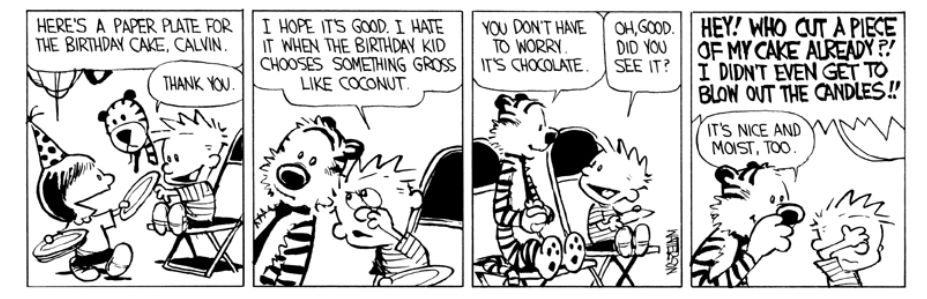
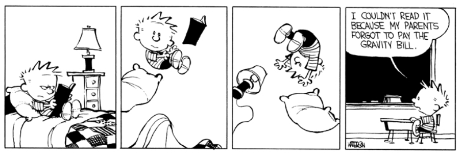

Durante le vacanze di Natale sono tornato in Italia. Ci voleva proprio. E' stato bello vedere Mamma e Pap&agrave;,
mio fratello Pietro, nonni, zii, amici, la propria casa e i posti famigliari. E devo dire che non ho cucinato per
tutta la permanenza!

Sono andato a qualche festa ad orari umani, ossia che non cominciasse alle 19.00 e si dovesse aver gi&agrave; cenato.
E non mi sono comportato troppo da sociopatico. ;)

Sono tornato a sentire il telefono squillare di Pap&agrave; con un'odiosa suoneria ed a rispondere alle chiamate al
telefono fisso di casa.

Ho sentito a destra e manca dire che "<em>le giornate sono ancora corte, ma si stanno allungando</em>", quando io ero
abituato a vedere il tramonto alle 14.40. E di conseguenza ridere in faccia alle persone, ma avere un'irrefrenabile
impulso a strangolarle.
&nbsp;
Ma la conversazione che pi&ugrave; volte mi &egrave; capitata e pi&ugrave; temevo &egrave; la seguente:
padovano tipo: "<em>Finalmente &egrave; arrivato il freddo! Ma tu sarai abituato a ben peggio, no?</em>"
io, battendo i denti: "<em>Ehm, in realt&agrave; ho pi&ugrave; freddo qui, deve essere questa umidit&agrave;.</em>"

padovano tipo: "<em>Ess&igrave;, l'umidit&agrave; ti entra nelle ossa e non ci puoi far niente e poi questa
nebbia,&nbsp;</em><i>ess&igrave; l'umidit&agrave; ti penetra dentro bla bla bla</i>"...

Sono anche tornato, nonostante sia ormai entrata nella mia mentalit&agrave;, alle abituali pulizie del sabato
mattina.

Questa vignetta non centra, ma mi piace e quindi la voglio inserire.

E in tutto questo ho anche provato a studiare, ma &egrave; stato veramente dura e le scuse sono state molteplici,
dunque questa prima settimana a Stoccolma l'ho passata a studiare nella mia nuova casa, di cui vi parler&ograve; in
un prossimo futuro.

