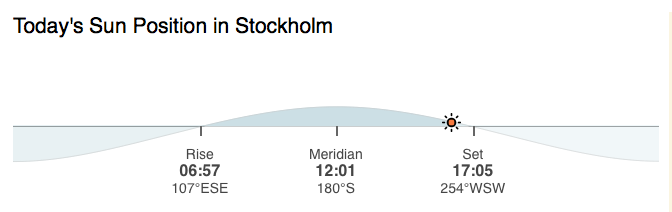
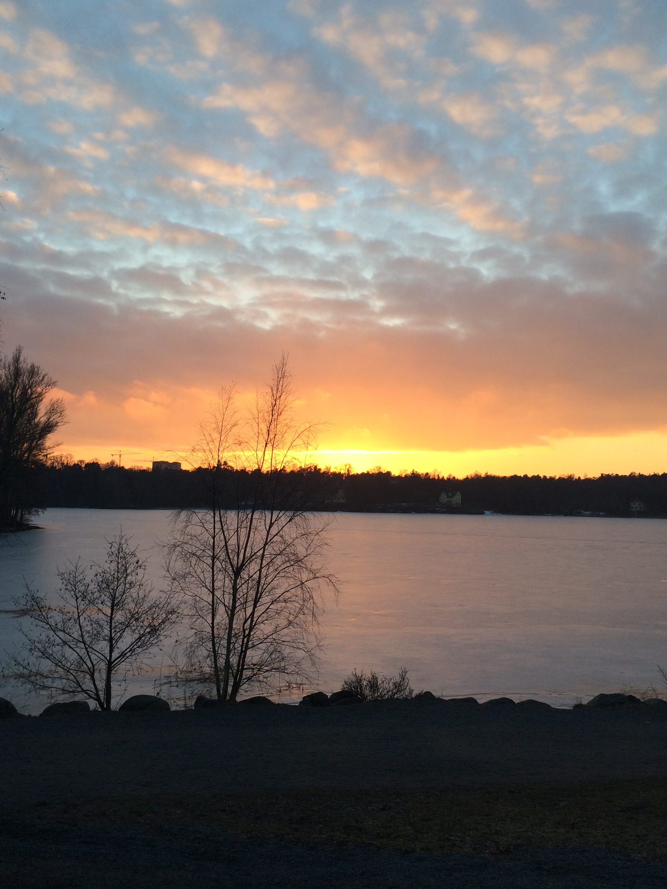

Si sa che in Scandinavia l'inverno &egrave; buio. Se non lo sapete ve lo dico io: Novembre e Dicembre so bui. Ma bui.
Tipo quando siete sotto la doccia senza sei diottrie e pi&ugrave;, in casa per sbaglio sono accesi lavatrice e
forno, o lavatrice o lavastoviglie o .. e parte la corrente e voi non sapete neppure dove sia lo sportello della
doccia. Buio.

Ma ora stiamo andando verso la primavera: 7 gradi, luce, cielo blu. Da quando sono tornato l'undici Gennaio a
Stoccolma ogni giorno si &egrave; allungato di circa 5 minuti. Super! Lo so per certo perch&eacute; pattugliavo
questo website che deve essere stato pensato per dare speranza ai terroni europei:
<a href="http://www.timeanddate.com/astronomy/sweden/stockholm">http://www.timeanddate.com/astronomy/sweden/stockholm</a>

Stoccolma riprende colore. Speriamo che anche gli Swedish abbandonino i vestiti neri, a cui sono tanto affezionati.

