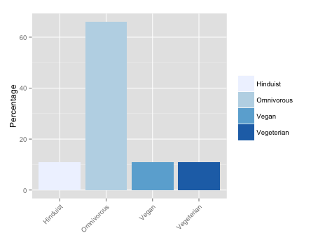
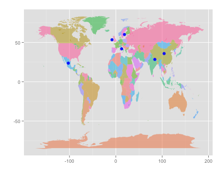
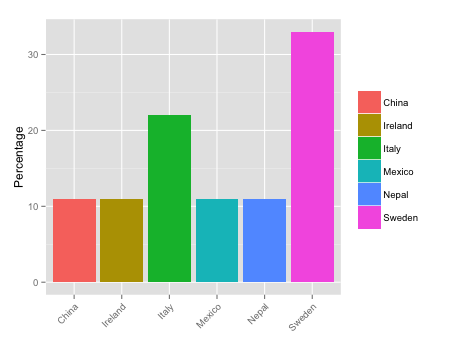
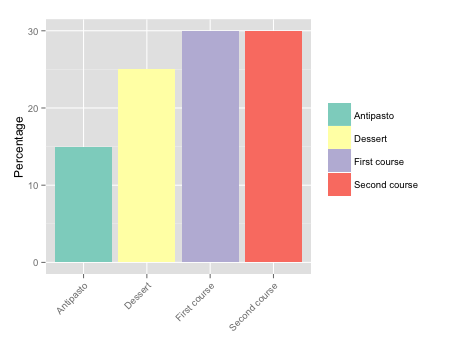
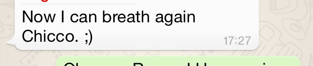
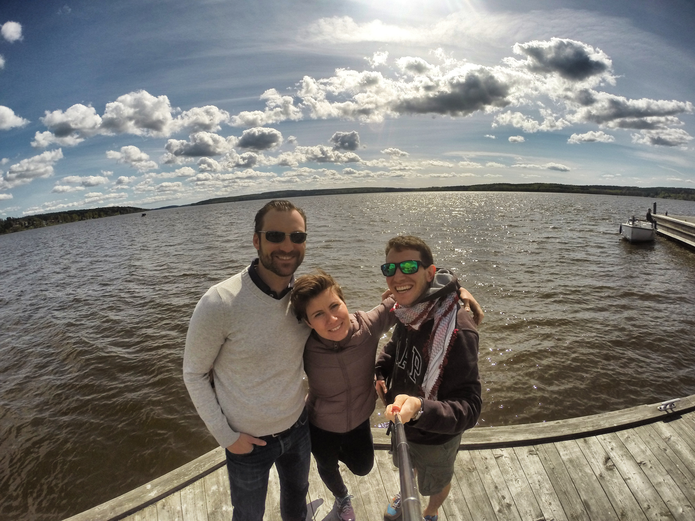

Torno a scrivere qualcosa per raccontare come ho passato il mio compleanno. A tre settimane dal rientro in Italia e dalla fine del primo anno di master&nbsp;&egrave; anche una verifica di come sia andato questo primo anno a Stoccolma.
Un mese fa ho chiesto ad Ylva se potessi organizzare una cena per festeggiarmi. Qui a Stoccolma bisogna muoversi con un mese di preavviso per dar tempo agli invitati di metabolizzare psicologicamente&nbsp;il fatto&nbsp;che dovranno interagire con altre persone. So traumi!
Il mio trauma, invece, &egrave; stato conciliare un men&ugrave; per vegeteriani, vegani ed induisti e onnivori (con richiesta di avere un po' di carne). Nulla contro queste scelte, ma tutte in una volta e nello stesso tavolo &egrave; da spararsi, soprattutto se vuoi far vedere come funziona una cena in Italia. Non quel buttare tutto sullo stesso piatto senza religione.

Eravamo in nove. Purtroppo mancavano un po' di persone, ma in ogni caso &egrave; stato molto divertente. Mi piace essere riuscito a legare in questo anno con svedesi e non, insomma non essermi circondato di soli Italiani.

Per giunta, Ylva mi aveva&nbsp;consigliato di dire a questi&nbsp;casi umani di portarsi il proprio cibo, ma non me la son proprio sentita. Quindi, ho preso possesso della cucina per pi&ugrave; di un giorno. E via a spignattare. Per antipasto ho fatto pizzette (senza mozzarella per vegani, senza carne per vegetariani). Poi cannelloni ripieni di rag&ugrave; di maiale (ocio alla mucca) e di ricotta, funghi e spinaci, ma non basta&nbsp;Zhiyin mi ha aiutato a fare dei noddles vegani. Gi&agrave; si dichiaravano pieni, ma la tortura non era ancora finita: parmigiana e peperonata di secondo. Infine, tiramis&ugrave; e macedonia.

Uso esponenziale di piatti e bicchieri. Mi &egrave; piaciuto che mi siano stati chiesti i chopstick al posto delle posate e io ho osservato come si potessero mangiare i cannelloni con le bacchette affrontando la forza di gravit&agrave;.
Insomma, sar&agrave; stato uno sforzo provvedere a cibo per tutti, ma mi sono divertito ed ho ricevuto anche bei regali. Ora, non per fare il retorico, ma da anche soddisfazione essere riuscito ad instaurare amicizie qui su cui poter contare.
Dopo aver possesso della casa, ho addirittura preso la macchina di Ylva in prestito. Ho guidato. Ahahahah
Tuttavia, vi assicuro che guido come un italiano anche qui. Il che significa guardare i pedoni come il nemico.&nbsp;Questo, appunto,&nbsp;il messaggio ricevuto da Ragnar dopo averlo informato che avevo parcheggiato l'auto in garage.

&nbsp;
Siamo stati a Sigtuna, ritenuta la citt&agrave; pi&ugrave; antica della Svezia (980 d.C.). Ahahah

Passer&ograve; la maggior parte del tempo al pc a scrivere, legger e far di conto, ma sono proprio felice delle persone che sto incontrando e lo scrivo in italiano cos&igrave; non lo vengono a sapere! ;)
P.S.
Nessun bicchiere &egrave; stato sottoposto a lavaggio in lavastoviglie. Manovalanza italiana li ha lavati delicatamente uno ad uno. ;) Giuro Ylva!
P.S. 1
Oggi ero in vena di perdere tempo e mi son messo a fare grafici in R&nbsp;<a href="../src/images/wp/2015/05/birthday.pdf">birthday</a>!
